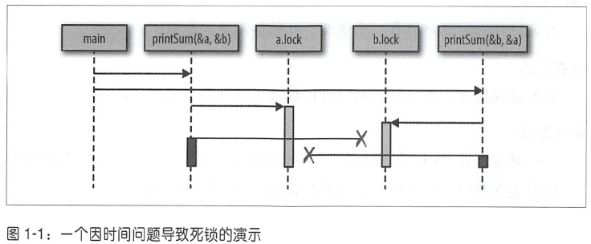

# 死锁
运行此段代码，将会看到
```shell
fatal error: all goroutines are asleep - deadlock!
```
下图是运行时的图形表示

图中的框代表函数，水平线代表调用这些函数，竖线表示图形头部函数的生存时间

本质上程序创建了两个不能转动的齿轮：
- 第一次调用printSum锁定a，然后试图锁定b
- 在此期间，第二次调用printSum已锁定b并试图锁定a
这两个goroutine都无限等待着

它符合死锁发生的四个必要条件：
1. printSum 函数确实需要a和b的独占权，所以它满足了**相互排斥**这个条件。
2. 因为printSum持有a或b并正在等待另一个，所以它满足**等待条件**。
3. 没有任何办法让goroutine被抢占，满足**没有抢占**这个条件。
4. 第一次调用printSum正在等待第二次调用；反之亦然，这构成了循环等待。