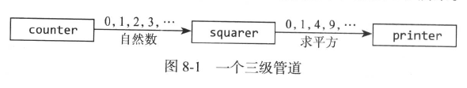

# 管道
通道可以用来连接goroutine，这样一个的输出是另一个的输入，这称为管道

pipline1中的程序由三个goroutine组成，它们被两个通道连接起来，如下图所示

第一个goroutine是counter，产生一个0,1,2,3,...的整数序列，然后通过一个通道发送给square，计算数值的平方，然后将结果通过另一个通道发送给第三个goroutine(printer)，接收值并输出
