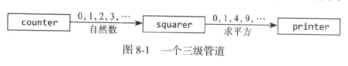

# 关闭通道
通道可以用来连接goroutine，这样一个的输出是另一个的输入，这称为管道

pipline2中的程序由三个goroutine组成，它们被两个通道连接起来，如下图所示

第一个goroutine是counter，产生一个0,1,2,3,...100的整数序列，然后通过一个通道发送给square，计算数值的平方，然后将结果通过另一个通道发送给第三个goroutine(printer)，接收值并输出

当发送方没有更多数据发送时，调用close来关闭通道，通知接收者所在goroutine可以停止等待

pipline2中counter在发送100个元素后结束循环时关闭naturals通道，导致squarer结束循环并关闭squares通道，最终主goroutine结束，程序退出

