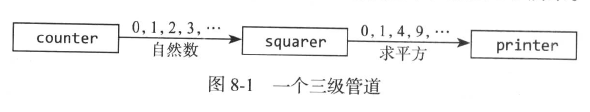

# 单向通道
通道可以用来连接goroutine，这样一个的输出是另一个的输入，这称为管道

pipline2中的程序由三个goroutine组成，它们被两个通道连接起来，如下图所示

第一个goroutine是counter，产生一个0,1,2,3,...100的整数序列，然后通过一个通道发送给square，计算数值的平方，然后将结果通过另一个通道发送给第三个goroutine(printer)，接收值并输出

单向通道仅仅导出发送或接收操作
- 类型chan<- int是一个只能发送的通道，允许发送但不允许接收
- 类型<-chan int是一个只能接收的通道，允许接收但不允许发送

close操作仅仅在发送方上可以使用，试图关闭一个仅仅能接收的通道会报错

可以将双向通道转化为单向通道，但不能反向操作